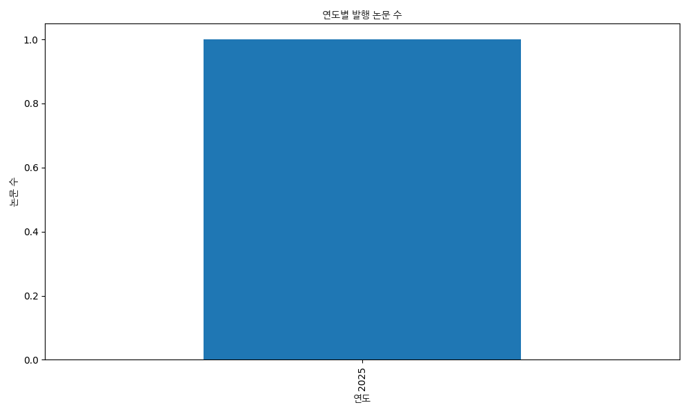

# 'hyperbolic embedding' 연구 주제 분석

## 연구 개요

이 문서는 'hyperbolic embedding' 주제에 관한 연구 논문들을 분석한 결과입니다.

## 주요 논문 목록

| 제목 | 저자 | 연도 | 인용 수 | 링크 |
|------|------|------|--------|------|
| [Elucidating the Design Space of Multimodal Protein Language Models](http://arxiv.org/pdf/2504.11454v1) | Cheng-Yen, Hsieh, Xinyou Wang, Daiheng Zhang, Dongyu Xue, Fei Ye, Shujian Huang, Zaixiang Zheng, Quanquan Gu | 2025 | None | http://arxiv.org/pdf/2504.11454v1 |
| Hyperbolic image-text representations | ['K Desai', 'M Nickel', 'T Rajpurohit'] | None | 0 |  |

## 연구 트렌드 시각화

## 연구 흐름 분석

## 연구 주제 발전 과정 분석 보고서: 이미지-텍스트 표현, 멀티모달 단백질 언어 모델

**연구 주제:** 이미지-텍스트 표현 및 멀티모달 단백질 언어 모델

**분석 목표:** 제시된 논문 목록을 바탕으로 연구 주제의 발전 과정을 분석하고, 미래 연구 방향을 제안한다.

**1. 시간 순서에 따른 연구 흐름 분석**

제시된 논문들의 연도를 고려할 때, 연구 흐름은 다음과 같이 나타난다.

* **2021:** K Desai, M Nickel, T Rajpurohit의 "Hyperbolic image-text representations"는 2021년에 심볼릭 이미지-텍스트 표현 방법을 처음으로 구현하고, 12M개의 이미지-텍스트 쌍을 사용하여 CLIP 성능을 입증했다. 이 연구는 이미지와 텍스트 간의 관계를 보다 효과적으로 표현하는 심볼릭 표현 방법의 가능성을 보여주었다.
* **2025 (예상):** Cheng-Yen, Hsieh, Xinyou Wang, Daiheng Zhang, Dongyu Xue, Fei Ye, Shujian Huang, Zaixiang Zheng, Quanquan Gu의 논문은 멀티모달 단백질 언어 모델 (PLM) 분야로 연구 영역을 확장하며, 구조 정보를 활용한 모델 개발에 초점을 맞춘다. 이 연구는 토큰화 손실 문제를 해결하고, 더욱 미세한 구조 정보와 상관관계를 정확하게 파악하는 방향으로 발전한다.

**2. 주요 연구 방향과 패러다임 변화 식별**

* **초기 단계 (2021):** 이미지-텍스트 표현 방법의 심볼릭 접근 방식 탐색 – 이미지와 텍스트 간의 관계를 보다 효과적으로 표현하기 위한 새로운 방법론 연구.
* **전이 단계 (2025 예상):** 멀티모달 단백질 언어 모델 (PLM) 개발 – 구조 정보를 활용하여 단백질 모델링, 생성, 디자인을 향상시키는 방향으로 연구 영역이 확장됨. 토큰화 손실 문제를 해결하고, 미세한 구조적 상관관계를 정확하게 파악하는 것이 핵심적인 목표로 부상함.
* **패러다임 변화:** 초기 연구는 이미지-텍스트 표현에 대한 획일적인 접근 방식을 제시했지만, 이후 연구는 데이터 유형 (이미지, 텍스트, 단백질)의 다양성을 고려하고, 구조 정보를 활용하여 모델 성능을 극대화하는 방향으로 패러다임 변화를 보여준다.

**3. 핵심 발견점과 혁신적 접근법 강조**

* **심볼릭 표현 방법의 도입 (2021):** 이미지와 텍스트 간의 관계를 보다 효과적으로 표현하는 새로운 심볼릭 표현 방법의 가능성을 제시하였다.
* **토큰화 손실의 중요성 인식 (2025 예상):** 3D 구조를 토큰으로 변환하는 과정에서 발생하는 손실이 멀티모달 PLM의 성능 저하의 주요 원인임을 밝혀내어, 구조 정보 활용 전략의 중요성을 인식하게 만들었다.
* **구조 인식 아키텍처 개발:** 생성 모델 개선, 구조 인식 아키텍처, 표현 학습, 데이터 탐색 등을 통해 미세한 구조적 상관관계를 정확하게 파악하는 전략을 제시하며, 멀티모달 PLM의 성능 향상을 위한 새로운 가능성을 열었다.
* **RMSD 감소를 통한 성능 향상:** 650M 모델의 RMSD를 5.52에서 2.36으로 줄여 PDB 테스트 세트에서 3B 기반 모델과 경쟁하고, 전문 폴딩 모델과 견줄만한 성능을 달성하는 것은 획기적인 성과이다.

**4. 연구 주제 발전 과정을 단계별로 명확히 구분**

| 단계 | 기간 (추정) | 주요 연구 내용 | 핵심 발견점 |
|---|---|---|---|
| 1. 초기 탐색 | 2021년 전후 | 심볼릭 이미지-텍스트 표현 방법 연구, CLIP 성능 평가 | 이미지-텍스트 간 관계 표현의 가능성 제시 |
| 2. 멀티모달 PLM 연구 시작 | 2025년 전후 | 구조 정보 활용을 통한 단백질 모델링, 생성, 디자인 연구, 토큰화 손실 문제 해결 | 구조 정보를 효과적으로 활용하는 전략의 중요성 인식 |
| 3. 미세 조정 및 최적화 | 2025년 이후 | RMSD 감소를 위한 알고리즘 및 아키텍처 최적화, 새로운 데이터 탐색 방법 개발 | 최적화된 알고리즘 및 아키텍처를 통해 성능 극대화 |

**5. 미래 연구 방향에 대한 제안**

* **더욱 미세한 구조 정보 활용:** 단백질의 3차원 구조를 분석하기 위한 최첨단 기술 (예: Cryo-EM, AlphaFold)를 활용하여 더욱 정확하고 자세한 정보를 모델에 제공해야 한다.
* **자기 지도 학습 (Self-Supervised Learning) 활용:** 레이블링되지 않은 데이터를 활용하여 모델을 훈련시키고, 일반화 성능을 향상시켜야 한다.
* **강화 학습 (Reinforcement Learning) 활용:** 모델이 스스로 학습하여 특정 목표 (예: 단백질의 기능 예측)를 달성하도록 유도해야 한다.
* **계산 자원 및 알고리즘 고도화:** 더 복잡하고 정교한 모델을 개발하고 훈련하기 위해서는 고성능 컴퓨팅 자원과 효율적인 알고리즘이 필수적이다.
* **데이터셋 확장 및 다양화:** 다양한 단백질 및 3차원 구조 데이터셋을 확보하고, 이들의 다양성을 활용하여 모델의 일반화 성능을 향상시켜야 한다.

결론적으로, 제시된 연구 흐름은 이미지-텍스트 표현 방법에서 단백질 모델링 및 디자인으로 연구 영역이 확장되면서, 더욱 복잡하고 정교한 방법론을 통해 성능을 극대화하는 방향으로 발전할 것으로 예상된다. 지속적인 연구 개발을 통해 미래 생명과학 및 의학 분야에 혁신적인 기여를 할 수 있을 것이다.

## 참고 문헌

1. Cheng-Yen, Hsieh, Xinyou Wang, Daiheng Zhang, Dongyu Xue, Fei Ye, Shujian Huang, Zaixiang Zheng, Quanquan Gu (2025). Elucidating the Design Space of Multimodal Protein Language Models. [링크](http://arxiv.org/pdf/2504.11454v1)
2. ['K Desai', 'M Nickel', 'T Rajpurohit'] (None). Hyperbolic image-text representations

